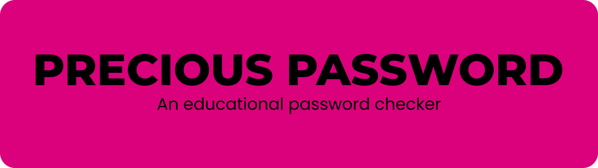

Precious Password is a practical use app that is capable of taking a user defined password and to check if the password meets the requirements for safe passwords.

You can use the live app [here](https://precious-password-2beae8772161.herokuapp.com/)

## USER STORIES

### USER GOALS (US1-PP3):

- As a user I want to know if my chosen password meets minimum requirements to be safe
- As a user I want to know if my password is included in breach data, so I can decide my next steps
- As a user I want to know if my password is commonly used, so I can avoid using it

## FEATURES

## DESIGN

There isn't not much design involved in this project. The main website uses the Code Institute PP3 template. However, there are some colors used in the app itself to add a better visual aid so the user can interpret the meaning of the messages displayed. The outputs were kept fairly simple using the color red for undesired output and the color green for desired output.

## TOOLS USED

### PREVIS

Wireframes are not involved here, but there is a flowchart for the general program flow

### CODING

The project was realized with the following tools:

- [Visual Studio Code](https://code.visualstudio.com/) for writing and testing the code locally
- The [Python extension](https://marketplace.visualstudio.com/items?itemName=ms-python.python) with [autopep8](https://marketplace.visualstudio.com/items?itemName=ms-python.autopep8) for Visual Studio Code
- The [Code Institute PEP8 code validator](https://pep8ci.herokuapp.com/) for error scanning

### TECHNOLOGIES

The code was entirely written using [Python 3.11.4](https://www.python.org/) with the following libraries:

- [Hashlib](https://pypi.org/project/hashlib/) for generating SHA-1 checksums

- [Requests](https://pypi.org/project/requests/) for handling the GET-request to the pwned password api

- [Re](https://docs.python.org/3/library/re.html) for using regex incantations

- [Colorama](https://pypi.org/project/colorama/) for colorful terminal output

- [Pyfiglet](https://pypi.org/project/pyfiglet/) for the ascii banner

- sleep() imported from [Time](https://pypi.org/project/python-time/) to add slight delays

- [Simple Term Menu](https://pypi.org/project/simple-term-menu/) for the interactive menu

#### IMPORTANT NOTE:

*The menu part of the program will not work using Windows, because the Simple Term Menu does not work on windows. The program was developed on Archlinux. There are workarounds to overcome this like installing a [WSL terminal](https://github.com/IngoMeyer441/simple-term-menu/issues/5) but we wont go over the steps because they are out of scope for this readme. However, the program needs to be updated to check if the OS is windows or linux and then use a different menu like [dumb_menu](https://github.com/cornradio/dumb_menu) which works on windows. The menu part of the program will still work in the browser and on linux machines.*

## OTHER TOOLS

todo

## TESTING

For the test results please refer to the TESTING.md file.

## DEPLOYMENT

The app was deployed using GitHub and Heroku. GitHub acts as the version control and code repository, Heroku is the app host. To deploy a webapp like this follow these steps:

- In GitHub, set up a code repository and push your code you want to deploy
- In Heroku, select to create a new app. It is the only option you get presented if you don't have any apps yet
- Connect your GitHub account using the "Deploy" from tab within the new app you created - you need to follow the prompts
- Go to the Settings tab and press the "Reveal Config Vars" button and enter the Key "PORT" with the value "8000" - this step is mandatory
- Head down to the build packs and add the python and the nodejs buildpack
- Back to the Deploy tab you can now choose to build the app either automatic or manual - I chose manual
- The app gets built and you can access it through the link the Heroku websie provides

## LOCAL DEPLOYMENT

### LOCAL DEPLOYMENT USING VSCODE:

You can also have a copy of the program on your local machine. It will work without the browser. To do so follow these steps:

- Open your GitHub folder in Visual Studio Code

- Open a terminal in Visual Studio Code

- Tye the following:

  `git clone https://github.com/RebellionWebdesign/precious-password.git`
  
- The repository will get cloned to your machine

- Once the repository is cloned, you need a virtual environment for it to work. In the terminal type:

  `python3 -m venv venv`

- This will create a new virtual environment for you. Now you need to activate it:

  `source venv/bin/activate`

- Next you will need to install the dependencies using pip, to do so type in the terminal:

  `pip install -r requirements.txt`

- Don´t forget to add the venv folder to your .gitignore file, you don't need to push it to the repository. Open up the file and on a new line add:

  `venv/`

- You can now start the program by clicking the play button in the upper right corner

## FUTURE IMPROVEMENTS

- *Check the OS and use different code for the menu part.* The reason for this is being discussed under TECHNOLOGIES > IMPORTANT NOTE
- *Add the ability to use the PasswordCheck class for multiple requests.* Since we have a class we can use instances of the class for storing multiple passwords and their corresponding datasets.

## CREDITS

todo

## SAYING THANKS

- [Juliia Konovalova](https://github.com/IuliiaKonovalova) for being my mentor and helping through some of the issues I encountered on the project
- My family for bearing with me and for keeping me grounded.
- [Code Institute](https://codeinstitute.net/de/) for letting me do this and for being a great school.
- [Kevin Powell](https://www.youtube.com/@KevinPowell) for being such a great CSS teacher.