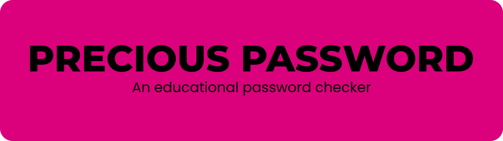

Precious Password is a practical use app that is capable of taking a user defined password and to check if the password meets the requirements for safe passwords.

You can use the live app [here](https://precious-password-2beae8772161.herokuapp.com/)

## HOW TO USE THE APP

- Go to the live app following this link: [Precious Password Live](https://precious-password-2beae8772161.herokuapp.com/)

- If the program doesn't start automatically, press the "RUN PROGRAM" button 

- Choose between Simple Feedback Mode, Advanced Feedback Mode or read the manual first.

- Type in a password of your choosing following the prompts and see how safe your password is. 

## USER STORIES

### USER GOALS (US1-PP3):

- As a user I want to know if my chosen password meets minimum requirements to be safe
- As a user I want to know if my password is included in breach data, so I can decide my next steps
- As a user I want to know if my password is commonly used, so I can avoid using it

## FEATURES

- **THE WELCOME SCREEN**

  Upon load the program displays a friendly welcome screen which invites the user to select a menu option and follow the prompt.

  - [The Welcome Screen](https://github.com/RebellionWebdesign/precious-password/blob/3558a6e5a75d51e41c6d9127cfaa732663a1bf55/docs/readme-images/screenshots/precious-password-welcome-screen.png)

  

- **WHEN THE USER CHOOSES SIMPLE FEEDBACK MODE**

  When choosing simple mode the user gets a confirmation on which mode was chosen and a prompt to type in a password.

  - [Simple Mode Start Screen](docs/readme-images/screenshots/precious-password-simple-mode.png)
  
  
  
- **WHEN THE USER TYPES A PASSWORD**

  In the next step the user types in a password and starts the program. The program analyzes the password and gives the user visual feedback on password frequency, complexity and if the password was part of a data breach or nor not. To aid the user visually, undesirable outcomes have a red background and desirable outcomes have a green background.
  
    - [Simple Mode With Red Text](docs/readme-images/screenshots/precious-password-simple-mode-red.png)

  - [Simple Mode With Green Text](docs/readme-images/screenshots/precious-password-simple-mode-green.png)
  
  
  
  After the password is analyzed the user gets asked if there is another password to test. When the user selects yes, the program asks if the user wants to change the mode. Here the user can select **s** for **simple mode**, **a** for **advanced mode** and **q** to **quit**.
  
  - [Mode Change Question](docs/readme-images/screenshots/precious-password-simple-mode-green-with-questions.png)
  
  
  
  If the user wishes to quit, a friendly good bye message gets displayed and the program reloads after three seconds.
  
  - [The User Quits](docs/readme-images/screenshots/precious-password-simple-mode-quit.png)
  
  
  
  *If the user decides to select the advanced mode, this can be done seamlessly by selecting the option. **Advanced Feedback Mode does the same as Simple Feedback Mode but adds additional information on the password** like the resulting SHA-1 checksum and how it gets divided into the prefix and the suffix. Because both modes are similar and work the same we won´t go over the advanced mode in detail.*
  
  - [The Advanced Mode With Extra Info](docs/readme-images/screenshots/precious-password-advanced-mode-with-extra-info.png)
  
  

- **WHEN THE USER CHOOSES RTFM (READ THE FRIENDLY MANUAL)**

  If the user decides to read the manual by selecting the corresponding menu option the maual will get displayed. The user needs to scroll up a bit to read the complete text which explains what the program does and what the user has to do along with a link to the pwned passwords website documentation and a link to this repository if the user wants to study the code. When the user is done reading pressing enter will send the user back to the main menu.

  - [The Manual Screen](docs/readme-images/screenshots/precious-password-rtfm.png)

  

- **WHEN THE USER CHOOSES TO QUIT FROM THE MAIN MENU**

  It is possible to quit the program from the main menu. If the user decides to quit the program will also ask for confirmation and if the user chooses yes, the program will reload.

## DESIGN

There isn't not much design involved in this project. The main website uses the Code Institute PP3 template. However, there are some colors used in the app itself to add a better visual aid so the user can interpret the meaning of the messages displayed. The outputs were kept fairly simple using the color red for undesired output and the color green for desired output.

## TOOLS USED

### PREVIS

Wireframes are not involved here, but there are flowcharts for the general program flow and how the functions work in the testing section.

### CODING

The project was realized with the following tools:

- [Visual Studio Code](https://code.visualstudio.com/) for writing and testing the code locally
- The [Python extension](https://marketplace.visualstudio.com/items?itemName=ms-python.python) with [autopep8](https://marketplace.visualstudio.com/items?itemName=ms-python.autopep8) for Visual Studio Code
- The [Code Institute PEP8 code validator](https://pep8ci.herokuapp.com/) for error scanning

### LANGUAGES AND LIBRARIES

The code was entirely written using [Python 3.11.4](https://www.python.org/) with the following libraries:

- [Hashlib](https://pypi.org/project/hashlib/) for generating SHA-1 checksums
- [Requests](https://pypi.org/project/requests/) for handling the GET-request to the pwned password api
- [Re](https://docs.python.org/3/library/re.html) for using regex incantations
- [Colorama](https://pypi.org/project/colorama/) for colorful terminal output
- For the addition of delays we need the ***sleep*** function which comes with [time](https://docs.python.org/3/library/time.html)
- [Console Menu](https://pypi.org/project/console-menu/) for the interactive menu

## OTHER TOOLS

- The flowcharts were made with [draw.io](https://www.drawio.com/) - an open source flowchart design app

## TESTING

For the test results please refer to the [TESTING.md](docs/readme-images/screenshots/heroku-live-link.png) file.

## DEPLOYMENT

The app was deployed using [GitHub](https://github.com/) and [Heroku](https://www.heroku.com/). GitHub acts as the version control and code repository, Heroku is the app host. To deploy a webapp like this follow these steps:

- In GitHub, set up a code repository and push your code you want to deploy

  - [Example Repository](docs/readme-images/screenshots/github-repo.png)

- In Heroku, select "New" to create a new app. It is the only option you get presented if you don't have any apps yet.

  If you already have an app, the button will be in the upper right corner. 

  - [Add New App](docs/readme-images/screenshots/heroku-new.png)

- Then give the app a name and select your country and press "Create app"

  - [Create App](docs/readme-images/screenshots/heroku-name-and-country.png)

- Connect your GitHub account using the "Deployment method" button within the new app you created - you need to follow the prompts
  - [Connect to GitHub](docs/readme-images/screenshots/heroku-github-connect.png)
- Go to the Settings tab and press the "Reveal Config Vars" button and enter the Key "PORT" with the value "8000" - this step is mandatory
  - [Config Vars](docs/readme-images/screenshots/heroku-config-vars.png)
- Head down to the build packs and add the python and the nodejs buildpack
  - [Build Packs](docs/readme-images/screenshots/heroku-build-packs.png)
- Back to the Deploy tab you can now choose to build the app either automatic or manual - I chose manual
  - [Deploy on Heroku](docs/readme-images/screenshots/heroku-deploy.png)
- The app gets built and you can access it through the link the Heroku website provides
  - [Live Link](docs/readme-images/screenshots/heroku-live-link.png)

## LOCAL DEPLOYMENT

### LOCAL DEPLOYMENT USING VSCODE:

You can also have a copy of the program on your local machine. It will work without the browser. To do so follow these steps:

- Open your GitHub folder in Visual Studio Code

- Open a terminal in Visual Studio Code

- Tye the following:

  `git clone https://github.com/RebellionWebdesign/precious-password.git`
  
- The repository will get cloned to your machine

- Once the repository is cloned, you need a virtual environment for it to work. In the terminal type:

  `python3 -m venv venv`

- This will create a new virtual environment for you. Now you need to activate it:

  `source venv/bin/activate`

- Next you will need to install the dependencies using pip, to do so type in the terminal:

  `pip install -r requirements.txt`

- Don´t forget to add the venv folder to your .gitignore file, you don't need to push it to the repository. Open up the file and on a new line add:

  `venv/`

- You can now start the program by clicking the play button in the upper right corner

## FUTURE IMPROVEMENTS

- *Add the ability to use the PasswordCheck class for multiple requests.* Since we have a class we can use instances of the class for storing multiple passwords and their corresponding datasets.
- *Make the program modular.* This means to move the program functions to separate files (e.g. functions.py etc.) and keep the run.py file uncluttered.
- Refactor the main menu code to be more efficient.
- Make the functions talk to each other rather than using the PasswordCheck class for getting data.

## CREDITS

Credits go the developers who built the used libraries. Usually these are developed by teams, so you can have a look at the developers from the links in [TECHNOLOGIES](#technologies).

Credits for the [passwords list](https://github.com/danielmiessler/SecLists/blob/master/Passwords/Common-Credentials/10k-most-common.txt) go to [Daniel Miessler](https://github.com/danielmiessler)

## SAYING THANKS

- [Juliia Konovalova](https://github.com/IuliiaKonovalova) for being my mentor and helping through some of the issues I encountered on the project
- My family for bearing with me and for keeping me grounded.
- [Code Institute](https://codeinstitute.net/de/) for letting me do this and for being a great school.
- [Kevin Powell](https://www.youtube.com/@KevinPowell) for being such a great CSS teacher.