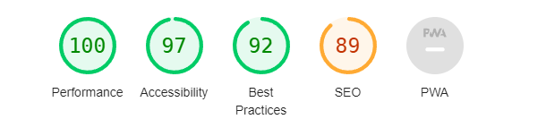

# TESTING

## COMPATIBILITY

To ensure the website works on many different browsers, the website was tested on Chrome, Firefox Developer Edition, Edge and Brave.

### CHROME:

[Precious Password on Chrome](https://github.com/RebellionWebdesign/precious-password/blob/0623a95fb289bf8750cc2372e747573fdfc9de3a/docs/testing-images/pp3-chrome-compat.png)

### FIREFOX:

[Precious Password on Firefox Developer Edition](https://github.com/RebellionWebdesign/precious-password/blob/0623a95fb289bf8750cc2372e747573fdfc9de3a/docs/testing-images/pp3-firefox-dev-compat.png)

### EDGE:

[Precious Password on Edge](https://github.com/RebellionWebdesign/precious-password/blob/0623a95fb289bf8750cc2372e747573fdfc9de3a/docs/testing-images/pp3-edge-compat.png)

### BRAVE:

[Precious Password on Brave](https://github.com/RebellionWebdesign/precious-password/blob/0623a95fb289bf8750cc2372e747573fdfc9de3a/docs/testing-images/pp3-brave-compat.png)

***NOTE: Testing on Apples Safari Browser was omitted due to the lack of access to Apple devices***

## RESPONSIVE BEHAVIOR:

Responsive behaviour was not testet due to being out of scope for this project.

## MANUAL TESTING

Manual tests were made by myself, friends and family and CI community members. The following section describes the testing of the underlying functions and screen outputs in alphabetical order.

- **advanced_mode()**

  | FEATURE                                                      | ACTION                             | EXPECTED RESULT                                              | TESTED | PASSED | COMMENT |
  | ------------------------------------------------------------ | ---------------------------------- | ------------------------------------------------------------ | ------ | ------ | ------- |
  | Notifies the user about the selection made                   | Select advanced mode from the menu | Starts advanced mode                                         | yes    | yes    |         |
  | Calls get_password, hash_password and check_password_frequency | Start advanced mode                | Functions get called and their results get printed           | yes    | yes    |         |
  | Validates password complexity positively by calling check_password_complexity | Start advanced mode                | If the password meets the requirements notify the user with green text | yes    | yes    |         |
  | Validates password complexity by calling check_password_complexity, warns user | Start advanced mode                | If the password does not meet the requirements notify the user with red text | yes    | yes    |         |
  | Calls check_password_database                                | Start advanced mode                | Calls the function to check the pwned passwords api          | yes    | yes    |         |
  | Calls new_test_question                                      | Start advanced mode                | Calls the function to ask if the user wishes to test a new password | yes    | yes    |         |

- **back_to_main()**

  | FEATURE                 | ACTION                                                       | EXPECTED RESULT                                              | TESTED | PASSED | COMMENT                                             |
  | ----------------------- | ------------------------------------------------------------ | ------------------------------------------------------------ | ------ | ------ | --------------------------------------------------- |
  | Return to the main menu | In the manual page press enter when prompted                 | When pressed the user gets back to the main menu             | yes    | yes    |                                                     |
  | Input validation        | The function should only accept an empty string confirmed with the Enter button | If something else is enterd to the prompt the user gets asked to only press Enter | yes    | yes    | [Output](docs/testing-images/back-to-main-test.png) |

- **check_password_complexity**()

  | FEATURE                                                      | ACTION                               | EXPECTED RESULT                                              | TESTED | PASSED | COMMENT |
  | ------------------------------------------------------------ | ------------------------------------ | ------------------------------------------------------------ | ------ | ------ | ------- |
  | Checks if the password has at least 8 characters using len() | Function runs automatic, gets called | returns True when criteria is met, returns False when criteria is not met | yes    | yes    |         |
  | Checks if the password has at least one uppercase letter using regex | Function runs automatic, gets called | returns True when criteria is met, returns False when criteria is not met | yes    | yes    |         |
  | Checks if the password has at least one lowercase letter using regex | Function runs automatic, gets called | returns True when criteria is met, returns False when criteria is not met | yes    | yes    |         |
  | Checks if the password has at least one lowercase letter using regex | Function runs automatic, gets called | returns True when criteria is met, returns False when criteria is not met | yes    | yes    |         |
  | Checks if the password has at least one digit using regex    | Function runs automatic, gets called | returns True when criteria is met, returns False when criteria is not met | yes    | yes    |         |
  | Checks if the password has at least one special character using regex | Function runs automatic, gets called | returns True when criteria is met, returns False when criteria is not met | yes    | yes    |         |
  | Password validation                                          | Function runs automatic, gets called | Returns True when all critera are met, otherwise False       | yes    | yes    |         |

- **check_password_database()**

  | FEATURE                                                      | ACTION                               | EXPECTED RESULT                                              | TESTED | PASSED | COMMENT |
  | ------------------------------------------------------------ | ------------------------------------ | ------------------------------------------------------------ | ------ | ------ | ------- |
  | Notifies user about checking the database                    | Function runs automatic, gets called | Prints text to console when starting, adds 2 sec delay       | yes    | yes    |         |
  | Sends GET request to pwned passwords API with specified prefix using requests | Function runs automatic, gets called | Uses the prefix from pw_prefix and appends it to the API address | yes    | yes    |         |
  | Strips API answer from colons and numbers following the colon using regex | Function runs automatic, gets called | Changes APi answers from this form: 0018A45C4D1DEF81644B54AB7F969B88D65:1 to this form: 0018A45C4D1DEF81644B54AB7F969B88D65 | yes    | yes    |         |
  | Compares if generated suffix is found in the API answer      | Function runs automatic, gets called | If suffix is found, prints red warning text and sets pw_in_db to "YES"; if suffix is not found prints green positive text | yes    | yes    |         |

- **check_password_frequency()**

  | FEATURE                                                      | ACTION                               | EXPECTED RESULT                                              | TESTED | PASSED | COMMENT |
  | ------------------------------------------------------------ | ------------------------------------ | ------------------------------------------------------------ | ------ | ------ | ------- |
  | Takes the generated passwords list (in memory) and searches for the password the user has given | Function runs automatic, gets called | If password is found, notify the user with red text, sets pw_in_list to "YES" | yes    | yes    |         |
  |                                                              |                                      | If password is not found, notify the user with green text, sets pw_in_list to "NO" | yes    | yes    |         |

- **clear_screen()**

  | FEATURE                                                 | ACTION                               | EXPECTED RESULT                                              | TESTED | PASSED | COMMENT |
  | ------------------------------------------------------- | ------------------------------------ | ------------------------------------------------------------ | ------ | ------ | ------- |
  | Checks if underlying OS is windows                      | When function gets called, automatic | Uses "cls" to clear the screen when windows is detected, uses "clear" when MacOS or Linux is detected | yes    | yes    |         |
  | Gets called everytime the user changes the program mode | User chooses a different mode        | Clears the screen                                            | yes    | yes    |         |

- **exit_program()**

  | FEATURE                                      | ACTION                                                       | EXPECTED RESULT                          | TESTED | PASSED | COMMENT |
  | -------------------------------------------- | ------------------------------------------------------------ | ---------------------------------------- | ------ | ------ | ------- |
  | Asks user if he really wants to quit         | Select quit on the start screen or from the question displayed at mode change | Displays question                        | yes    | yes    |         |
  | Prints goodbye message when user quits       | Select "y" when asked                                        | Displays text                            | yes    | yes    |         |
  | Prints restart message when user doesnt quit | Select "n" when asked                                        | Displays text                            |        |        |         |
  | Calls clear_screen (on y and n)              | Automatic                                                    | Screen gets cleared before printing text | yes    | yes    |         |
  | Adds 3 sec delay (on y and n)                | Automatic                                                    | Waits 3 sec befor continuing             | yes    | yes    |         |
  | Calls main()                                 | Automatic                                                    | Restarts program                         | yes    | yes    |         |
  | Input validation                             | Validates if input is "y" or "n"                             | See above                                | yes    | yes    |         |
  |                                              | validates if the answer is something else, notifies user that the answer is not correct | Displays text                            | yes    | yes    |         |
  | Calls exit_program()                         | Restarts function when neither "y" or "n" is pressed         | Resets the function                      | yes    | yes    |         |
## CODE VALIDATION

The underlying code was validated with Code Institutes PEP8 validator

## LIGHTHOUSE REPORTS

### LANDING PAGE

## BUGS
