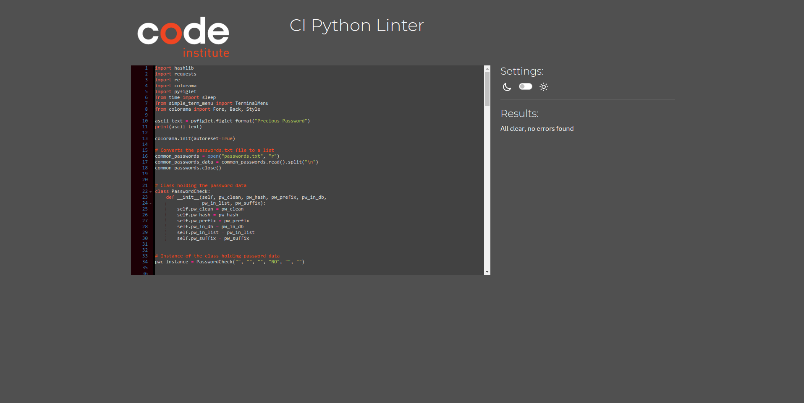

# TESTING

## COMPATIBILITY

To ensure the website works on many different browsers, the website was tested on Chrome, Firefox Developer Edition, Edge and Brave.

### CHROME:

https://github.com/RebellionWebdesign/fab-forever/assets/80954446/defef3bc-5f46-427d-b130-82e560cc9fa6

### FIREFOX:

https://github.com/RebellionWebdesign/fab-forever/assets/80954446/9d9f7de2-c826-4be2-92d7-196fbc41eb06

### EDGE:

https://github.com/RebellionWebdesign/fab-forever/assets/80954446/3c2b92e7-1735-43d0-833a-7c1ba5edf421

### BRAVE:

https://github.com/RebellionWebdesign/fab-forever/assets/80954446/8ac3696d-9b3f-4b4a-9b27-6e948c42c49f

## RESPONSIVE BEHAVIOR:

Responsive behaviour was not testet due to being out of scope for this project.

## MANUAL TESTING

Manual tests were made by myself, friends and family and CI community members.

 

|             FEATURE              |               ACTION               |               EXPECTED RESULT               | TESTED | PASSED | COMMENT |
| :------------------------------: | :--------------------------------: | :-----------------------------------------: | :----: | :----: | :-----: |
|            User Greeter            |   start program   |                  displays a welcome message                  |  yes   |  yes   | integrated into the main menu |
|  Main Menu - Simple Feedback mode  |  select the mode  |               starts the simple feedback mode                |  yes   |  yes   |                               |
| Main Menu - Advanced Feedback Mode |  select the mode  |              starts the advanced feedback mode               |  yes   |  yes   |                               |
|          Main Menu - RTFM          | select the entry  |              displays a manual for the program               |        |        |                               |
|          Main Menu - Quit          | select the entry  | asks if the user wants to quit, then displays a message and sends the user back to the menu |  yes   |  yes   |                               |
|    Simple Mode input validation    | start simple mode | the input function should loop until a valid password is given (valid = no spaces at start and end) |  yes   |  yes   |                               |
|                                    |                   |                                                              |        |        |                               |
|                                    |                   |                                                              |        |        |                               |
|                                    |                   |                                                              |        |        |                               |
|                                    |                   |                                                              |        |        |                               |
|                                    |                   |                                                              |        |        |                               |
|                                    |                   |                                                              |        |        |                               |
|                                    |                   |                                                              |        |        |                               |
|                                    |                   |                                                              |        |        |                               |
|                                    |                   |                                                              |        |        |                               |
|                                    |                   |                                                              |        |        |                               |
|                                    |                   |                                                              |        |        |                               |
|                                    |                   |                                                              |        |        |                               |
|                                    |                   |                                                              |        |        |                               |
|                                    |                   |                                                              |        |        |         |

## CODE VALIDATION

The underlying code was validated with Code Institutes PEP8 validator

## LIGHTHOUSE REPORTS

### LANDING PAGE

### CONTENT PAGES

#### BASICS PAGE

#### MATERIALS PAGE

#### MODELS PAGE

#### HELP PAGE

### RESPONSE PAGE

## BUGS

### PAGE SIDESCROLLING ON MOBILE DEVICES

- There was an issue with the page content scrolling sideways on mobile devices. The mobile menu is built as a hidden sidebar
which widens the document body and therefore enables sidescrolling. The solution was to add the following, which constrains the document to the viewport width and hides overflow in the x-direction.

`body, html {
    width: 100%;
    overflow-x: hidden
}`

### WRONG RESPONSIVE BEHAVIOUR

- Another bug was related to responsiveness of the site where the shape dividers were overflowing and causing bad scaling on mobile devices.
The solution was to add the following to the dividers:

`.divider {
    width: 100%;
}`

### WRONG BEHAVIOUR FOR THE GRID CARDS

- The last bug was due to the grid cards having a large padding to the left which caused the grid container to overflow before collapsing.
The padding was inherited from the desktop viewport. The solution was to remove the padding from the media queries. 
